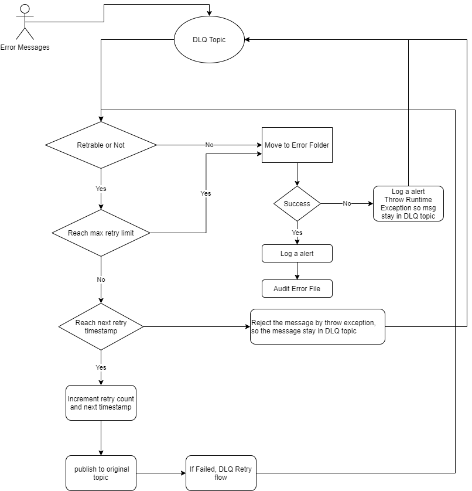

## DLQ (Dead letter queue) and Platform Error Handler Service documentation

1. ### Overview
In order to handle unexpected error or any other system error. When Pub/Sub service attempts to deliver a message but the subscriber can't acknowledge it, Pub/Sub can forward the undeliverable message to a dead-letter topic. And the Platform Error Handler Service subscribe to the dead letter queue and process the message either retry delivery message to original topic or same to bucket storage folder as non-retryable message.

2. ### Project Micro Service Configuration properties
Need add these configuration properties to micro service configurations for Error Hanlder Service to process the message

| Properties                          | Description                                                             |
|-------------------------------------|-------------------------------------------------------------------------|
| mediation.cloud.project             | The business project name                                               |
| mediation.cloud.pubsub.data.topic   | The target topic name for data send message                             |
| mediation.cloud.pubsub.audit.topic  | The target topic name for audit message                                 |
| mediation.cloud.pubsub.dlq.topic    | The DLQ topic name for rejected message                                 |
| mediation.cloud.audit.file.category | The category name for audit message. `CMIMicroBatchSource`              |
| mediation.cloud.error.bucket        | The storage bucket name for permanent store the rejected message        |
| mediation.cloud.error.folder        | The storage bucket folder name for permanent store the rejected message |
| gcs.projectid                       | The GCP project id for the micro service                                |

3. ### Platform Error Handler Service Configuration properties
These configuration properties are for Platform Error Handler Service.

| Properties                       | Description                                                                       |
|----------------------------------|-----------------------------------------------------------------------------------|
| mediation.cloud.dlq.retryLimit   | The retry limit for retry attempts after DLQ service redelivery to original topic |
| mediation.cloud.dlq.baseInterval | The retry interval for retry                                                      |

4. ### DLQ Setup 
When create all project work topic subscription should be set Subscription retry policy to enable Forwarding to dead-letter topics. Default is disabled.
This DLQ topic is available for all business projects.

5. ### Platform Error Handler Service (DLQ Service) Flow 
The (DLQ Service) will subscribe to DLQ topic when message arrived, the service will process the message. Here is flow diagram



5. ### Maven dependencies
For DLQ microservice, in addition to the spring dependencies, the following CAMP dependencies must be added to the service pom file:

```xml
        <dependency>
            <groupId>com.telus.mediationCloud</groupId>
            <artifactId>common-api</artifactId>
        </dependency>
        <dependency>
            <groupId>com.telus.mediationCloud</groupId>
            <artifactId>common-cache</artifactId>
        </dependency>
        <dependency>
            <groupId>com.telus.mediationCloud</groupId>
            <artifactId>common-gcs-file-producers</artifactId>
        </dependency>
        <dependency>
            <groupId>com.telus.mediationCloudUsage</groupId>
            <artifactId>cmi-business-models</artifactId>
        </dependency>
        <dependency>
            <groupId>com.telus.mediationCloud</groupId>
            <artifactId>common-producers-pubsub</artifactId>
        </dependency>
```

Right now we only support PUBSUB for DLQ , so need includes the module

```xml
        <dependency>
            <groupId>com.telus.mediationCloud</groupId>
            <artifactId>stream-sink-dlq-handler-pubsub-agent</artifactId>
        </dependency>
```

DLQ service maven project: [Pubsub Microbatch Processor Service](https://github.com/telus/cio-mediation/tree/nonprod/mediation-cloud-dlq-services)


